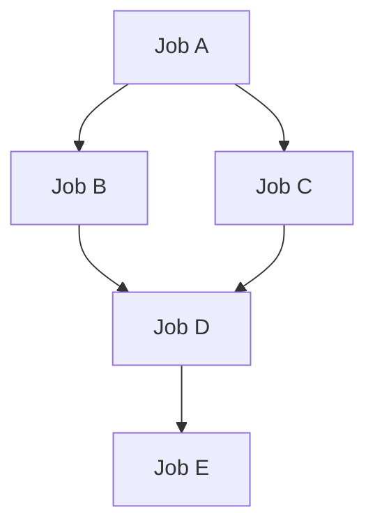

# daggerpool
DAG-driven worker pool orchestrator for Go: execute job graphs with concurrency limits, timeouts, retries, and structured results (frontiers/subtrees) for safe state reconciliation.

# Overview

This repository provides a Go library for building concurrent, deterministic workflows on top of a worker pool with explicit state handling.
The library is composed of a small set of focused packages:
 - `pkg/workerpool` Core execution engine for running jobs with bounded concurrency and controlled lifecycle.
 - `pkg/store` In-memory state storage used to track job execution, results, and transitions.
 - `pkg/readiness` Utilities for probing and waiting on readiness conditions, built around `context.Context` for safe cancellation and timeouts.

The project is designed as a library, not a framework — it provides composable building blocks that can be embedded into controllers, orchestrators, or higher-level systems.

# Usage

## workerpool

### Core concepts

Before diving into usage, it helps to understand the core concepts used throughout the worker pool and DAG execution model.

### Job

A job is the smallest unit of work executed by the system.
Conceptually, a job:
 - represents a single operation or step
 - returns an `error` to signal failure
 - respects `context.Context` for cancellation and timeouts
 - returns a bool flag to signal whether the job is ready (i.e., whether the workflow may continue)

In this library, a job is defined as:
```go
type Job interface {
	fmt.Stringer
	Do(ctx context.Context) (bool, error)
}
```
#### Example job
```go
type ExampleJob struct {
	name string
}

func (j ExampleJob) String() string { return j.name }

func (j ExampleJob) Do(ctx context.Context) (bool, error) {
	// Respect cancellation/timeouts.
	select {
	case <-ctx.Done():
		return false, ctx.Err()
	default:
	}

	// Do some work...
	// Return (true, nil) if the job reached the desired state.
	// Return (false, nil) if the job is not ready yet.
	// Return (false, err) if the job failed.
	return true, nil
}
```
## Directed Acyclic Graph (DAG)
A DAG (Directed Acyclic Graph) is a way to describe dependencies between jobs.
 - Nodes represent jobs
 - Edges represent dependencies between jobs
 - Directed means dependencies have a direction (A → B)
 - Acyclic means cycles are not allowed (a job cannot depend on itself, directly or indirectly)
 - In practice, a DAG answers the question:
 - Which jobs must finish before another job can start?


### What a DAG means in this project
In this library, a DAG describes how jobs depend on each other. Each node in the graph is identified 
by a job name, and a job is allowed to start only after all of its dependencies have completed. 
Jobs that do not depend on each other may run in parallel once their prerequisites are satisfied.
The DAG is represented as a simple Go map where the map key is the job name and the value is the list of job names that the job depends on.:
```go
type DAG map[string][]string
```
### Example DAG (conceptual)

**Explanation:**
 - Job A runs first
 - Job B and Job C depend on A and may run in parallel
 - Job D depends on both B and C
 - Job E depends on D and runs last

**Implementation:**
```go
dag := workerpool.DAG{
	"JobA": {},                 // no dependencies, runs first
	"JobB": {"JobA"},           // depends on A
	"JobC": {"JobA"},           // depends on A
	"JobD": {"JobB", "JobC"},   // depends on B and C
	"JobE": {"JobD"},           // depends on D
}
```

### Why DAGs are useful

Using a DAG allows you to:
 - express complex workflows clearly
 - run independent jobs in parallel
 - keep dependency logic outside of job implementations
 - reason about execution order deterministically
 - The worker pool uses the DAG to decide when a job may be scheduled, while the job itself focuses only on what to do.


### Worker Pool

The worker pool executes jobs concurrently while enforcing a fixed maximum concurrency (`maxConcurrentJobs`). It uses the DAG to decide when a job is allowed to run: jobs with zero remaining dependencies are scheduled first, and when a job finishes successfully, its successors’ dependency counters are decreased. Once a successor reaches zero remaining dependencies, it becomes eligible for scheduling.

Execution is bounded by a global timeout. The pool returns a `DAGResult` containing per-job status and errors.

#### Execution behavior

If a job returns an error, the worker pool cancels the whole run immediately and marks that job as failed. 
If a job completes without error but returns `isReady == false`, the job is marked as `NotReady` and the whole successor
subtree is marked as `Skipped`, meaning those jobs will not be scheduled. If a job returns `isReady == true` and no error,
the job is marked as `successful` and the workflow continues.

```go
pool, err := workerpool.NewWorkerPool(
	4,                      // maxConcurrentJobs
	[]workerpool.Job{...},  // jobs (keyed by job.String())
	dag,                    // dependencies
	logger,                 // zerolog logger
	10*time.Minute,         // global timeout
)
if err != nil {
	return err
}

result := pool.Start()
// inspect result (per-job status, failures, skipped subtree, timeout)
```
In the earlier DAG example, **Job A** runs first, then **Job B** and **Job C** can run in parallel once **A** completes,
**Job D** runs after both **B** and **C** complete, and Job **E** runs last. The worker pool will schedule each job as 
soon as it becomes eligible, subject to the configured concurrency limit.

### Evaluating results
`WorkerPool.Start()` returns a `DAGResult`, which captures the outcome of the whole run. It contains a `JobResult` 
per job (status + error) and additional helpers for reasoning about the graph state.


#### JobResult

```go
type DAGResult map[string]*JobResult 

type JobResult struct { 
	Name string 
	Status JobStatus 
	Error error 
}
```

Each job produces a JobResult with a status and an optional error. The status expresses how the job ended from the orchestration perspective:
 - **Success** – job executed and returned `isReady == true` with no error
 - **NotReady / InProgress** – job executed, returned `isReady == false` (the workflow cannot continue past this point)
 - **Skipped** – job was not executed because it belonged to a subtree that was intentionally skipped (e.g., successor of a `NotReady` job)
 - **Failed** – job returned an error; the run is cancelled immediately
 - **Unknown** – job was never reached/scheduled (typically due to cancellation/timeout)

You can iterate over results to inspect per-job state and errors.

#### Common checks
`DAGResult` exposes several convenience methods:
 - `IsReady() / IsNotReady()` – returns true only if all jobs are successful (no skipped/in-progress/failed)
 - `IsFailed()` – returns true if any job contains an error
 - `IsTimeouted()` – returns true if the run hit the global timeout
 - `FirstError()` – returns the first encountered error (if any)
 - `FirstInProgress()` – returns the first job that ended in `InProgress` (useful to report what is blocking readiness)

#### Example: checking the overall outcome
```go
result := pool.Start()

if result.IsTimeouted() {
	return fmt.Errorf("workflow timed out: %w", result.FirstError())
}

if result.IsFailed() {
	return fmt.Errorf("workflow failed: %w", result.FirstError())
}

if result.IsNotReady() {
	if jr := result.FirstInProgress(); jr != nil {
		return fmt.Errorf("workflow not ready (blocked at %s)", jr.Name)
	}
	return fmt.Errorf("workflow not ready")
}

// At this point all jobs are successful.
```

#### Example: inspecting per-job results
```go
for name, jr := range result {
	fmt.Printf("%s: status=%v err=%v\n", name, jr.Status, jr.Error)
}
```

### About frontiers and subtrees (DAG-aware reasoning)
Conceptually, frontiers represent the boundary between completed work and the next jobs that would become schedulable, 
while a subtree represents the set of successor jobs reachable from a given job. These concepts are useful for 
explaining what is blocking the workflow and which parts of the DAG were skipped after a NotReady decision.

If/when you expose helpers like `Frontiers()` or `BoundarySubtrees(dag DAG)` on `DAGResult`, they can be documented as 
DAG-aware views built on top of the per-job JobResult statuses.


## store
`pkg/store` is an optional thread-safe key/value store intended for keeping auxiliary state outside of jobs (e.g., execution snapshots and debugging/observability). 
**It should not be used as a primary data path between jobs or as the source of truth for orchestration decisions**.

## readiness package

### Single readiness check (Prober)
Use `Prober` when you want to check readiness once, without waiting.
```go
// prober protects a single check with a timeout
prober := readiness.NewProber(30 * time.Second)

// returns Ready, InProgress, or Error
status, err := prober.Check(ctx, id, checkFunc)
if err != nil {
	return err
}

if status.IsReady() {
	// resource is ready
}
```

### Wait until ready (Poller + Prober)
Use `Poller` together with `Prober` to wait until a resource becomes ready.
```go
// prober controls how long a single check may block
prober := readiness.NewProber(time.Minute)

// poller controls how often readiness is checked
poller := readiness.NewPoller(5*time.Second, prober)

// the provided timeoutCtx controls total wait time and cancellation
timeoutCtx, cancel := context.WithTimeout(ctx, time.Minute)
defer cancel()
status, err := poller.Check(timeoutCtx, id, checkFunc)
if err != nil {
	return err
}

// status is Ready
```

### Readiness check function

Both `Prober` and `Poller` use the same check function. The check function answers whether a resource has 
reached the state the caller is waiting for, such as being ready, deleted, or fully processed.
```go
checkFunc := func(ctx context.Context) (bool, error) {
    // must respect ctx
    return isResourceReady(), nil
}
```

# Contributing

## Pull Requests
When opening a Pull Request, please:
 - Keep PRs focused and minimal
 - Include tests where applicable
 - Add or update documentation/comments if behavior changes
 - Describe why the change is needed, not just what was changed
 - CI pipelines must pass before the PR can be reviewed.

## Design & Behavior Changes
 - For non-trivial changes (e.g. scheduling semantics, DAG behavior, readiness logic):
 - Prefer opening an issue first to discuss the approach
 - Be explicit about expected behavior and edge cases
 - Consider backward compatibility

